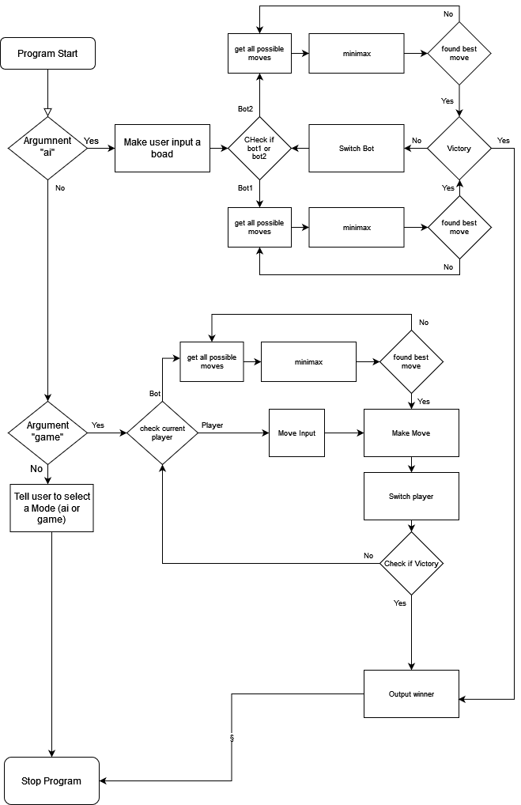

## Table of Contents
- [ Minimax (tic tac toe) OBS! this will be in swedish](#[-minimax-(tic-tac-toe)-obs!-this-will-be-in-swedish)
    - [ Hur man spelar ](#[-hur-man-spelar)
    - [ Flödesschema](#[-flödesschema)
    - [ Analys](#[-analys)
---
# Minimax (tic tac toe) OBS! this will be in swedish

så själva koden är inte direkt tagen från en källa, har mest bara kollat algoritmer och sen pratat med kompisar om hur man ska gå till väga.


### Hur man spelar 
För att köra programmet så har man några alternativ, antingen så kan man 2 ain spela mot varandra på ett fornestämt bräde. Du väljer då en utgångs position och datorn ska då försök vinna över sig själv. för att göra det så kör kommandot `python3 minmax.py ai` så kommer du få fram att du ska skriva in positioner för ett bräde. varje cell separeras med ett "," tecken och för en tom cell så gör man ett mellan rum. det kan då komma att se utt på följande sätt

```
row: x,o, 
row:  , ,x
row: o, , 
```

Om *du* istället vill spela mot ait så kör du kommandot `python minmax.py game [starter]`  starter byter du ut mot `me` eller `bot` vilket bestämmer vem som ska börja.
### Flödesschema
Nedan är flödes schemat som beskriver hur programmet funkar, vilka funktioner som körs när osv.

### Analys
Det finns delar av koden som man skulle kunna förbättra, bla själva minimax funktionen. Istället för att ha en "If" med 2 näst intill identiska loopar så skulle man bara ha kunnat gjort en loop och sen haft en if för att ändra de 2 rader som skiljer. 